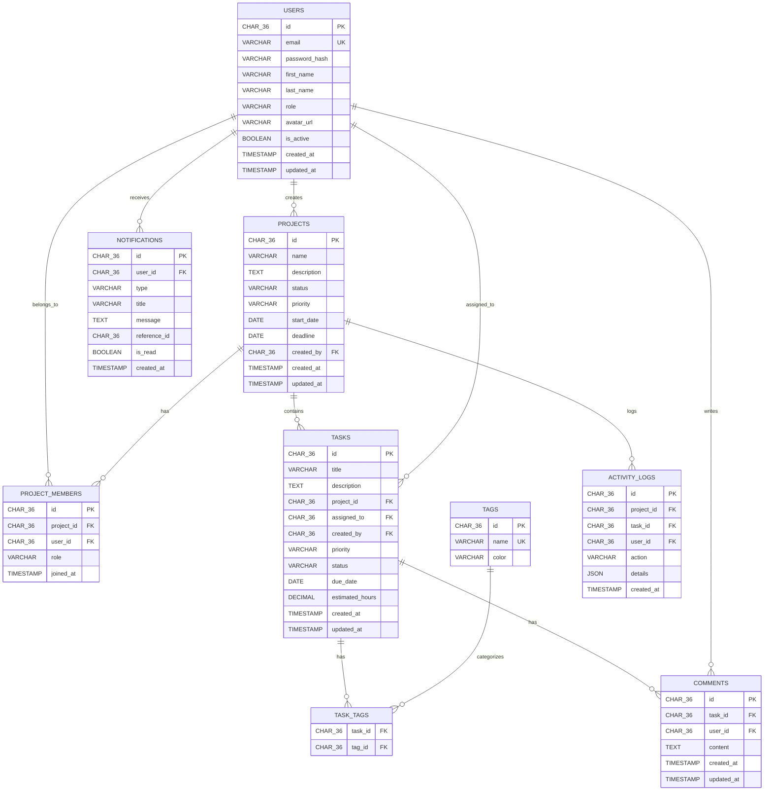

<![CDATA[<div align="center">

# 🚀 DevFlow
## ✨ Features
### 🎯 Project & Task Management
- **Multi-Project Workspace** — Create and manage unlimited projects with status tracking (Planning → Active → Completed → Archived)
- **Drag-and-Drop Kanban Board** — Intuitive task management with `@dnd-kit` powered Kanban columns (TODO → IN_PROGRESS → IN_REVIEW → DONE)
- **Task Assignment & Prioritization** — Assign tasks to team members with priority levels (Low / Medium / High / Urgent)
- **Due Date Tracking** — Visual overdue indicators with estimated hours tracking
- **Tagging System** — Color-coded tags for task categorization and filtering
- **Task Comments** — Threaded comments on tasks for team collaboration

### 🤖 AI-Powered Assistant
- **Auto-Generated Task Descriptions** — AI writes detailed task descriptions from titles using OpenAI GPT
- **Smart Subtask Breakdown** — Automatically decompose complex tasks into actionable subtasks
- **Project Status Summaries** — AI-generated standup-ready project progress reports
- **Graceful Fallback** — Full functionality without an API key; AI features enhance but don't block workflows

### 📊 Analytics Dashboard
- **Executive KPI Cards** — Active projects, assigned tasks, pending items, and overdue alerts at a glance
- **Sprint Completion Tracking** — Real-time progress bar with completion percentage
- **Live Activity Feed** — Real-time log of team actions across all projects
- **User Session Info** — Quick access to role, email, and system status

### 🔐 Authentication & Security
- **JWT Authentication** — Access tokens (15min) + refresh tokens (7 days) with httpOnly cookie support
- **Password Hashing** — bcrypt-based secure password storage
- **Role-Based Access** — User roles: `ADMIN`, `PROJECT_MANAGER`, `DEVELOPER`, `VIEWER`
- **Rate Limiting** — Configurable API rate limiting to prevent abuse
- **Helmet.js** — HTTP security headers out of the box
- **Input Validation** — Zod-powered request validation on all endpoints

### 🎨 Premium UI/UX
- **Dark Mode First** — Sleek, enterprise-grade dark interface with theme switching support
- **Responsive Design** — Fully responsive sidebar layout with collapsible navigation
- **Micro-Animations** — Smooth transitions, hover effects, and skeleton loading states
- **Modern Typography** — Plus Jakarta Sans + JetBrains Mono font pairing
- **Toast Notifications** — Non-intrusive feedback with `react-hot-toast`

### 👥 Team Management
- **Project Members** — Add/remove team members with role-based permissions per project
- **User Profiles** — Profile management with avatar support
- **Notification System** — In-app notifications for task assignments, comments, and project updates

---

## 🛠️ Tech Stack

### Frontend
| Technology | Purpose |
|---|---|
| **React 19** | UI framework with latest concurrent features |
| **TypeScript** | Type-safe development |
| **Vite 8** | Lightning-fast build tool & dev server |
| **Tailwind CSS 4** | Utility-first styling |
| **React Router v7** | Client-side routing with protected routes |
| **Zustand** | Lightweight state management |
| **@dnd-kit** | Drag-and-drop Kanban interactions |
| **Recharts** | Data visualization & charting |
| **Lucide React** | Modern icon library |
| **Axios** | HTTP client for API communication |
| **date-fns** | Date utility library |

### Backend
| Technology | Purpose |
|---|---|
| **Node.js + Express 4** | REST API server |
| **TypeScript** | Type-safe server logic |
| **Knex.js** | SQL query builder & migrations |
| **PostgreSQL / MySQL** | Relational database (dual support) |
| **JSON Web Tokens** | Stateless authentication |
| **bcryptjs** | Password hashing |
| **Zod** | Runtime schema validation |
| **Helmet** | HTTP security headers |
| **Morgan** | HTTP request logging |
| **OpenAI API** | AI-powered features (optional) |

---

## 🚀 Getting Started

### Prerequisites

- **Node.js** ≥ 18.x
- **npm** ≥ 9.x
- **PostgreSQL** ≥ 14 (or MySQL 8.0+)

### 1. Clone the Repository

```bash
git clone https://github.com/yourusername/devflow.git
cd devflow
```

### 2. Backend Setup

```bash
# Navigate to backend
cd backend

# Install dependencies
npm install

# Create environment file
cp .env.example .env
```

Edit `.env` with your configuration:

```env
# Server
PORT=5000
NODE_ENV=development

# Database (PostgreSQL)
DB_HOST=localhost
DB_PORT=5432
DB_NAME=devflow
DB_USER=postgres
DB_PASSWORD=your_password_here

# JWT Secrets (change these in production!)
JWT_SECRET=your-super-secret-jwt-key-change-in-production
JWT_REFRESH_SECRET=your-super-secret-refresh-key-change-in-production
JWT_EXPIRES_IN=15m
JWT_REFRESH_EXPIRES_IN=7d

# AI (Optional — app works fully without this)
OPENAI_API_KEY=

# CORS
CORS_ORIGIN=http://localhost:5173

# Rate Limiting
RATE_LIMIT_WINDOW_MS=900000
RATE_LIMIT_MAX_REQUESTS=100
```

```bash
# Create the database
psql -U postgres -c "CREATE DATABASE devflow;"

# Run migrations
npm run migrate

# (Optional) Seed sample data
npm run seed

# Start the development server
npm run dev
```

The API server will start at **http://localhost:5000**

### 3. Frontend Setup

```bash
# Navigate to frontend (from project root)
cd frontend

# Install dependencies
npm install

# Start the development server
npm run dev
```

The application will open at **http://localhost:5173**

### 4. Verify Setup

Visit the health check endpoint to confirm the backend is running:

```bash
curl http://localhost:5000/api/health
```

Expected response:
```json
{
  "success": true,
  "message": "DevFlow API is running",
  "timestamp": "2026-09-03T09:30:00.000Z",
  "environment": "development"
}
```

---

## 📡 API Documentation

### Base URL
```
http://localhost:5000/api
```

### Authentication Endpoints

| Method | Endpoint | Description |
|--------|----------|-------------|
| `POST` | `/auth/register` | Register a new user |
| `POST` | `/auth/login` | Login and receive JWT tokens |
| `POST` | `/auth/refresh` | Refresh access token |
| `POST` | `/auth/logout` | Logout and invalidate refresh token |

### User Endpoints

| Method | Endpoint | Description |
|--------|----------|-------------|
| `GET` | `/users/me` | Get current user profile |
| `PUT` | `/users/me` | Update current user profile |
| `GET` | `/users` | List all users (Admin) |

### Project Endpoints

| Method | Endpoint | Description |
|--------|----------|-------------|
| `GET` | `/projects` | List all projects for the user |
| `POST` | `/projects` | Create a new project |
| `GET` | `/projects/:id` | Get project details |
| `PUT` | `/projects/:id` | Update a project |
| `DELETE` | `/projects/:id` | Delete a project |
| `POST` | `/projects/:id/members` | Add a member to a project |
| `DELETE` | `/projects/:id/members/:userId` | Remove a member |
| `GET` | `/projects/:id/members` | List project members |

### Task Endpoints

| Method | Endpoint | Description |
|--------|----------|-------------|
| `GET` | `/tasks` | List tasks (with filters) |
| `POST` | `/tasks` | Create a new task |
| `GET` | `/tasks/:id` | Get task details |
| `PUT` | `/tasks/:id` | Update a task |
| `PATCH` | `/tasks/:id/status` | Update task status (Kanban move) |
| `DELETE` | `/tasks/:id` | Delete a task |

### Comment Endpoints

| Method | Endpoint | Description |
|--------|----------|-------------|
| `GET` | `/comments?taskId=:id` | List comments for a task |
| `POST` | `/comments` | Add a comment to a task |
| `DELETE` | `/comments/:id` | Delete a comment |

### Notification Endpoints

| Method | Endpoint | Description |
|--------|----------|-------------|
| `GET` | `/notifications` | List user notifications |
| `PATCH` | `/notifications/:id/read` | Mark notification as read |
| `PATCH` | `/notifications/read-all` | Mark all as read |

### AI Endpoints

| Method | Endpoint | Description |
|--------|----------|-------------|
| `POST` | `/ai/generate-description` | AI-generate a task description |
| `POST` | `/ai/generate-subtasks` | AI-generate subtask breakdown |
| `POST` | `/ai/project-summary` | AI-generate project summary |
| `GET` | `/ai/status` | Check AI service status |

### Analytics Endpoints

| Method | Endpoint | Description |
|--------|----------|-------------|
| `GET` | `/analytics/dashboard` | Dashboard KPI statistics |

> **Note:** All endpoints except `/auth/register`, `/auth/login`, and `/api/health` require a valid JWT in the `Authorization: Bearer <token>` header.

---

## 🗄️ Database Schema

The application uses a relational database with the following entity structure:



---

## 📁 Project Structure

```
devflow/
├── backend/                    # Express.js REST API
│   ├── src/
│   │   ├── config/             # Environment & database configuration
│   │   │   ├── database.ts     # Knex database connection
│   │   │   ├── env.ts          # Environment variable validation
│   │   │   └── knexfile.ts     # Knex migration config
│   │   ├── controllers/        # Route handlers (business logic)
│   │   │   ├── auth.controller.ts
│   │   │   ├── project.controller.ts
│   │   │   ├── task.controller.ts
│   │   │   ├── comment.controller.ts
│   │   │   ├── notification.controller.ts
│   │   │   └── analytics.controller.ts
│   │   ├── integrations/       # Third-party service integrations
│   │   │   └── ai.service.ts   # OpenAI GPT integration
│   │   ├── middleware/         # Express middleware
│   │   │   ├── auth.ts         # JWT authentication guard
│   │   │   ├── errorHandler.ts # Global error handler
│   │   │   └── validate.ts     # Zod validation middleware
│   │   ├── models/
│   │   │   ├── migrations/     # Database migration files
│   │   │   └── seeds/          # Seed data for development
│   │   ├── repositories/       # Data access layer
│   │   ├── routes/             # Express route definitions
│   │   │   ├── auth.routes.ts
│   │   │   ├── project.routes.ts
│   │   │   ├── task.routes.ts
│   │   │   ├── comment.routes.ts
│   │   │   ├── notification.routes.ts
│   │   │   ├── analytics.routes.ts
│   │   │   ├── ai.routes.ts
│   │   │   └── user.routes.ts
│   │   ├── services/           # Business logic services
│   │   ├── types/              # TypeScript type definitions
│   │   ├── utils/              # Utility functions & logger
│   │   ├── validators/         # Zod request schemas
│   │   ├── app.ts              # Express app factory
│   │   ├── server.ts           # Server entry point
│   │   ├── migrate.ts          # Migration runner script
│   │   └── seed.ts             # Seed runner script
│   ├── .env.example            # Environment template
│   ├── package.json
│   └── tsconfig.json
│
├── frontend/                   # React SPA
│   ├── public/                 # Static assets
│   │   ├── favicon.svg
│   │   └── icons.svg
│   ├── src/
│   │   ├── components/
│   │   │   ├── layout/         # App shell components
│   │   │   │   ├── AppLayout.tsx
│   │   │   │   ├── Sidebar.tsx
│   │   │   │   ├── TopNav.tsx
│   │   │   │   └── ProtectedRoute.tsx
│   │   │   └── ui/             # Reusable UI primitives
│   │   │       ├── Button.tsx
│   │   │       ├── Card.tsx
│   │   │       ├── Input.tsx
│   │   │       ├── Modal.tsx
│   │   │       ├── Badge.tsx
│   │   │       ├── Skeleton.tsx
│   │   │       └── EmptyState.tsx
│   │   ├── hooks/              # Custom React hooks
│   │   ├── lib/                # Shared utilities
│   │   ├── pages/              # Route-level page components
│   │   │   ├── LandingPage.tsx
│   │   │   ├── LoginPage.tsx
│   │   │   ├── RegisterPage.tsx
│   │   │   ├── DashboardPage.tsx
│   │   │   ├── ProjectsPage.tsx
│   │   │   ├── ProjectDetailsPage.tsx
│   │   │   ├── MyTasksPage.tsx
│   │   │   ├── GlobalKanbanPage.tsx
│   │   │   ├── AIAssistantPage.tsx
│   │   │   ├── TeamPage.tsx
│   │   │   ├── AnalyticsPage.tsx
│   │   │   ├── NotificationsPage.tsx
│   │   │   └── ProfilePage.tsx
│   │   ├── services/           # API service layer
│   │   ├── store/              # Zustand state stores
│   │   │   ├── authStore.ts
│   │   │   ├── projectStore.ts
│   │   │   ├── taskStore.ts
│   │   │   └── themeStore.ts
│   │   ├── types/              # TypeScript interfaces
│   │   ├── utils/              # Utility functions
│   │   ├── App.tsx             # Root component with routing
│   │   ├── main.tsx            # Application entry point
│   │   └── index.css           # Global styles & design tokens
│   ├── index.html              # HTML template
│   ├── package.json
│   ├── tsconfig.json
│   └── vite.config.ts          # Vite build configuration
│
└── README.md
```

---

## 🧪 Available Scripts

### Backend

| Command | Description |
|---------|-------------|
| `npm run dev` | Start dev server with hot-reload (tsx watch) |
| `npm run build` | Compile TypeScript to JavaScript |
| `npm start` | Run the production build |
| `npm run migrate` | Run database migrations |
| `npm run migrate:rollback` | Rollback the last migration batch |
| `npm run seed` | Seed the database with sample data |
| `npm test` | Run tests with Vitest |
| `npm run lint` | Lint source code with ESLint |

### Frontend

| Command | Description |
|---------|-------------|
| `npm run dev` | Start Vite dev server (port 5173) |
| `npm run build` | TypeScript check + production build |
| `npm run preview` | Preview the production build locally |

---

## 🔧 Configuration

### Environment Variables

| Variable | Default | Required | Description |
|----------|---------|----------|-------------|
| `PORT` | `5000` | No | API server port |
| `NODE_ENV` | `development` | No | Environment mode |
| `DB_HOST` | `localhost` | Yes | Database hostname |
| `DB_PORT` | `5432` | Yes | Database port |
| `DB_NAME` | `devflow` | Yes | Database name |
| `DB_USER` | `postgres` | Yes | Database username |
| `DB_PASSWORD` | — | Yes | Database password |
| `JWT_SECRET` | — | Yes | JWT signing secret |
| `JWT_REFRESH_SECRET` | — | Yes | Refresh token secret |
| `JWT_EXPIRES_IN` | `15m` | No | Access token TTL |
| `JWT_REFRESH_EXPIRES_IN` | `7d` | No | Refresh token TTL |
| `OPENAI_API_KEY` | — | No | OpenAI key for AI features |
| `CORS_ORIGIN` | `http://localhost:5173` | No | Allowed CORS origin |
| `RATE_LIMIT_WINDOW_MS` | `900000` | No | Rate limit window (ms) |
| `RATE_LIMIT_MAX_REQUESTS` | `100` | No | Max requests per window |

### Vite Proxy

The frontend dev server automatically proxies `/api` requests to `http://localhost:5000`, so no separate CORS configuration is needed during development.

---

## 🏗️ Architecture

```
┌──────────────────────────────────────────────────────────┐
│                    CLIENT (Browser)                       │
│  React 19 + Zustand + React Router + TailwindCSS 4       │
│  ┌──────────┐ ┌──────────┐ ┌──────────┐ ┌──────────┐    │
│  │ Landing  │ │Dashboard │ │ Kanban   │ │ AI Asst  │    │
│  │  Page    │ │  Page    │ │  Board   │ │  Page    │    │
│  └──────────┘ └──────────┘ └──────────┘ └──────────┘    │
└─────────────────────┬────────────────────────────────────┘
                      │ HTTP (REST API)
                      │ Vite Proxy → :5000
┌─────────────────────▼────────────────────────────────────┐
│                  API SERVER (Express)                     │
│  ┌──────────┐ ┌──────────┐ ┌──────────┐ ┌──────────┐    │
│  │  Auth    │ │ Project  │ │  Task    │ │   AI     │    │
│  │ Routes   │ │ Routes   │ │ Routes   │ │ Routes   │    │
│  └────┬─────┘ └────┬─────┘ └────┬─────┘ └────┬─────┘    │
│       │             │            │             │          │
│  ┌────▼─────────────▼────────────▼─────────────▼────┐    │
│  │              Middleware Layer                      │    │
│  │  JWT Auth │ Validation │ Rate Limit │ Error Handler│   │
│  └────────────────────┬──────────────────────────────┘    │
│                       │                                    │
│  ┌────────────────────▼──────────────────────────────┐    │
│  │            Repository / Service Layer              │    │
│  └────────────────────┬──────────────────────────────┘    │
└───────────────────────┼──────────────────────────────────┘
                        │ Knex.js Query Builder
┌───────────────────────▼──────────────────────────────────┐
│               DATABASE (PostgreSQL / MySQL)                │
│  Users │ Projects │ Tasks │ Comments │ Activity │ Notifs  │
└──────────────────────────────────────────────────────────┘
                        │
┌───────────────────────▼──────────────────────────────────┐
│             EXTERNAL SERVICES (Optional)                  │
│                   OpenAI GPT API                          │
└──────────────────────────────────────────────────────────┘
```

---

## 🤝 Contributing

1. Fork the repository
2. Create your feature branch (`git checkout -b feature/amazing-feature`)
3. Commit your changes (`git commit -m 'Add some amazing feature'`)
4. Push to the branch (`git push origin feature/amazing-feature`)
5. Open a Pull Request

---

## 📄 License

This project is licensed under the ISC License. See the [LICENSE](LICENSE) file for details.

---

<div align="center">

**Built with ❤️ by the DevFlow Team**

<sub>Enterprise Project Management • AI-Powered Workflows • Built for Scale</sub>

</div>
]]>
